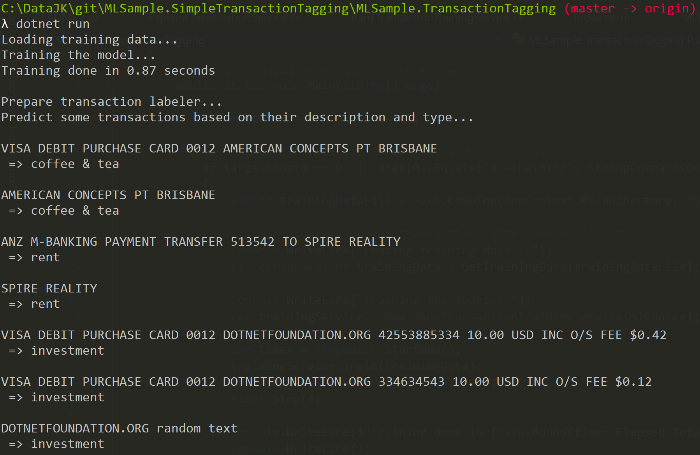
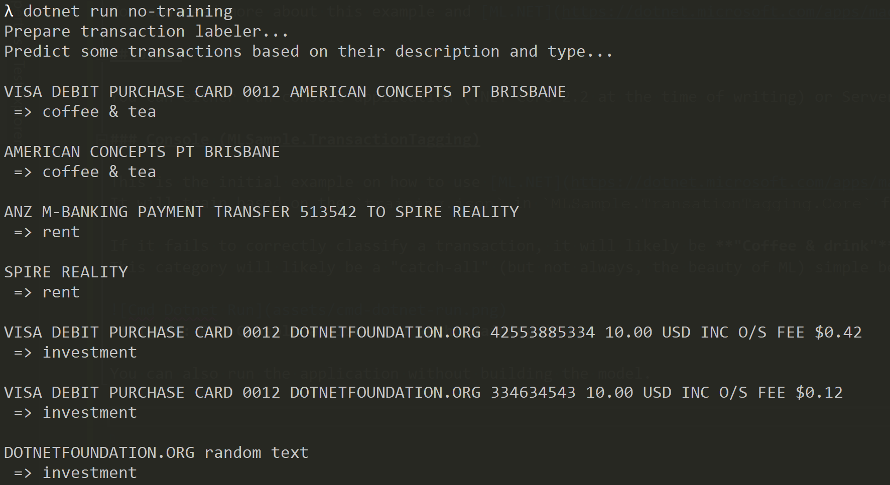
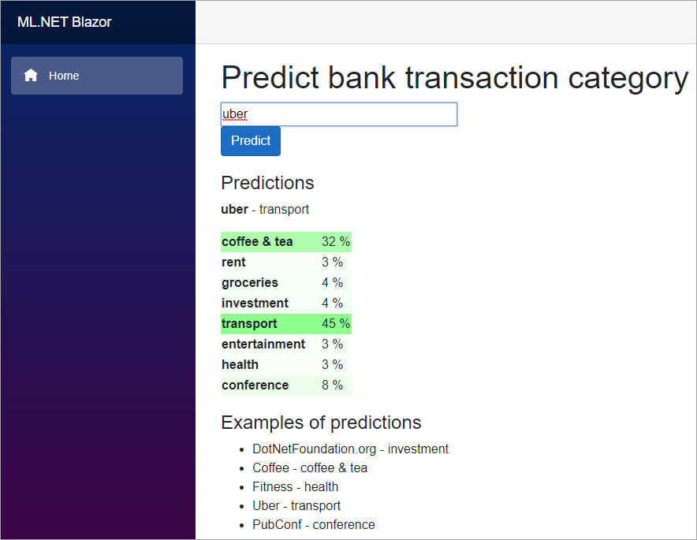
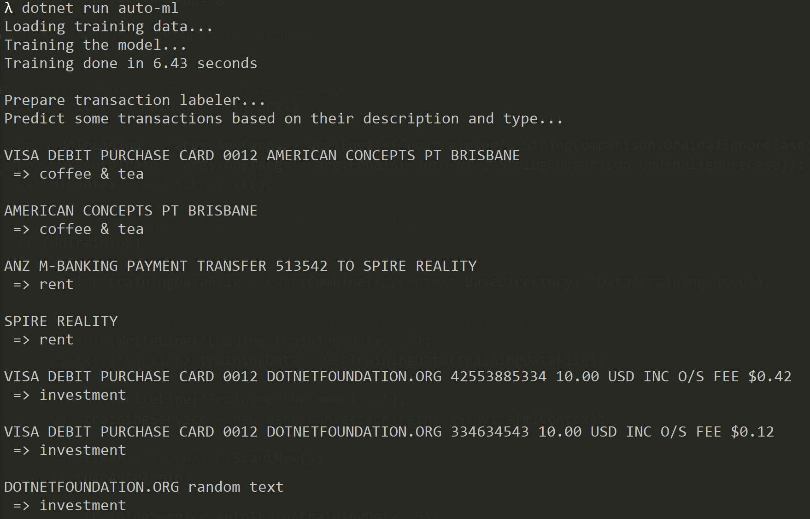
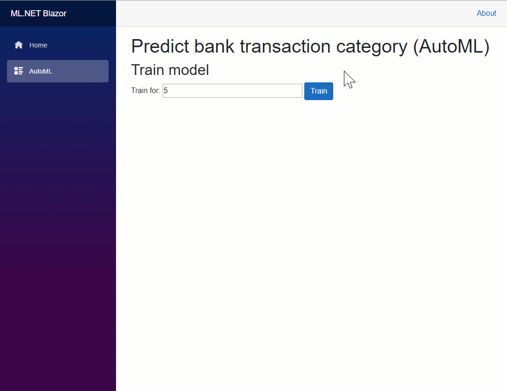

# MLSample.SimpleTransactionTagging
This is an simple example of tagging bank transactions with ML.NET built for a console as well as server-side Blazor application.

You can read more about this example and [ML.NET](https://dotnet.microsoft.com/apps/machinelearning-ai/ml-dotnet) on my blog post: [https://jkdev.me/simple-machine-learning-classification/](https://jkdev.me/simple-machine-learning-classification/?github)

Live demo: https://jernejk.github.io/MLSample.SimpleTransactionTagging/

## Usage

You can either run console application (.NET Core 2.2 at the time of writing) or Server-side Blazor (.NET Core 3.0) either via `dotnet run` or Visual Studio 2019.

### Console (MLSample.TransactionTagging)

This is the initial example on how to use [ML.NET](https://dotnet.microsoft.com/apps/machinelearning-ai/ml-dotnet) for classification.
It will train based on the `training.json` in `MLSample.TransationTagging.Core` file and it will classify a couple of example transaction descriptions.

If it fails to correctly classify a transaction, it will likely be **"Coffee & drink"**.
This category will likely be a "catch-all" (but not always, the beauty of ML) simple because training data has a lot of them.

**Figure: Run Console application with training.**

You can also run the application without building the model.
Just make sure to run the console application 1 time to generate the model, before trying to run it without training.

`dotnet run no-training`

**Figure: Run Console application without training.**

### Server-side Blazor

This is designed to be more interactive as well as you why ML.NET might have decided for a certain classification.
It uses dependency injection to train and load ML model, so it doesn't have to be reloaded every time we hit the page where we want to do classification.

The DI is done based on a MS blog post: https://devblogs.microsoft.com/cesardelatorre/how-to-optimize-and-run-ml-net-models-on-scalable-asp-net-core-webapis-or-web-apps/

Most of the code is in the `Startup.cs` and `Pages/Index.razor`.

**Figure: Example of Blazor application.**

**NOTE:** Client-side Blazor is currently not supported by ML.NET!

### Integration test

There is also a integration test, that tests the most common uses cases in my demos.
If they fail, it usually because my demo data has changed and confused ML.NET.

## AutoML

You can also try out AutoML, which will try to find the best trainer for the data.

For console run:

`dotnet run auto-ml`

**Figure: Running AutoML in console application.**

For Blazor:

Run the app, go to AutoML and click train. This will create a new model every time you train.

**Figure: Running AutoML in Blazor application.**
